# StudentPerformance
NOTE: EC2 deployment steps are shown below
# ------------------------------------------
- .ebextensions is config for deploying on AWS Elastic BeanStalk. It is a PaaS.
- Inside .ebextensions is a Python config since want to deploy in Python container. The format of that config file is fixed. It requires a start point in our application, named application. That is why we needed to create application.py
- So, for AWS Beanstalk deployment, .ebextensions and application.py are needed.
# ------------------------------------------
Similar configuration of application.py is needed for Azure.
# ------------------------------------------
Deployment using EC2 + Docker with the help of Github Actions done. Github Actions supports CI/CD through a .yaml file.
# ------------------------------------------
Procfile is needed by Heroku to specify entry point into our app.

# Deployment steps using EC2

Dockerfile is created. Used to create a Docker Image.

A main.yaml file defines the workflow that we are going to follow in the process of our deployment. This file is defined in .github/workflows , as per the requirement of Github Actions, through which we are going to do CI/CD. This main.yaml file was obtained as a template from Github Actions itself. It defineS the name of the deployment, files to ignore during deployment push, jobs to run, etc.

**Integration** is the CI step. Checks out code, checks linting, can run unit tests integration.

**Build-ecr image** When we push an image to the Docker Hub It usually publicly visible. But we want this to be private so we build a ecr(ElasticContainerRegistry) image which is like a private repo for Docker Images

**Continous Deployment** is the CD step. It configures AWS, pulls the latest Docker file, creates and runs the image on the AWS server.

**The steps I follow are, from Github -\> To AWS ECR -\> TO AWS EC2**

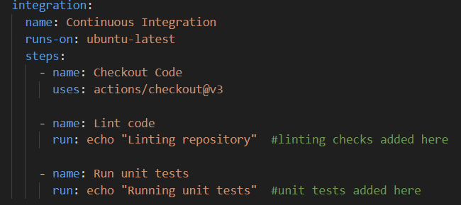

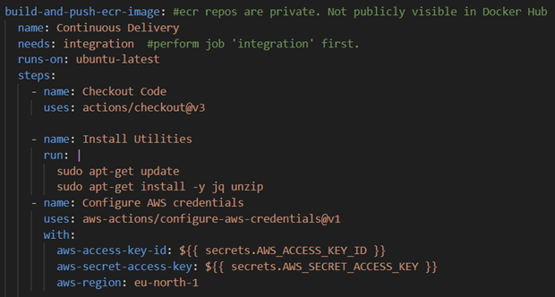

Multple steps are defined in build-ecr image.

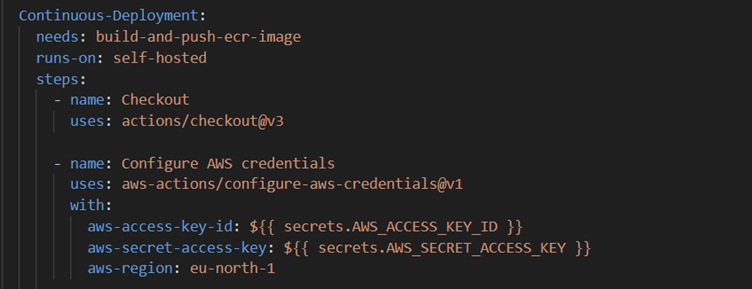

Next, we go to AWS Console and create a User through IAM.

Create a User with EC2ContainerRegistryFullAccess(Since we deploy Docker Image to ECR) and EC2FullAccess.

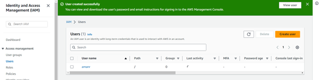

A CLI access key is made.

An ECR registration is done. That is, a private repo is created where our Docker Image will go.

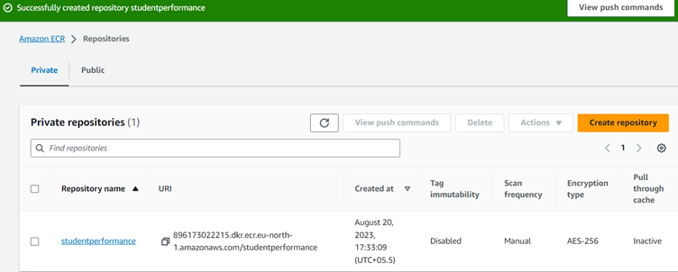

Keep the URL somewhere safe.

Then a Virtual Server in the Cloud is created, through EC2. Some config information is entered regarding the OS image, number of instances required, storage requirements, etc.

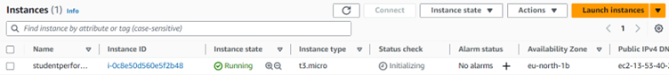

Connect to the server instance.

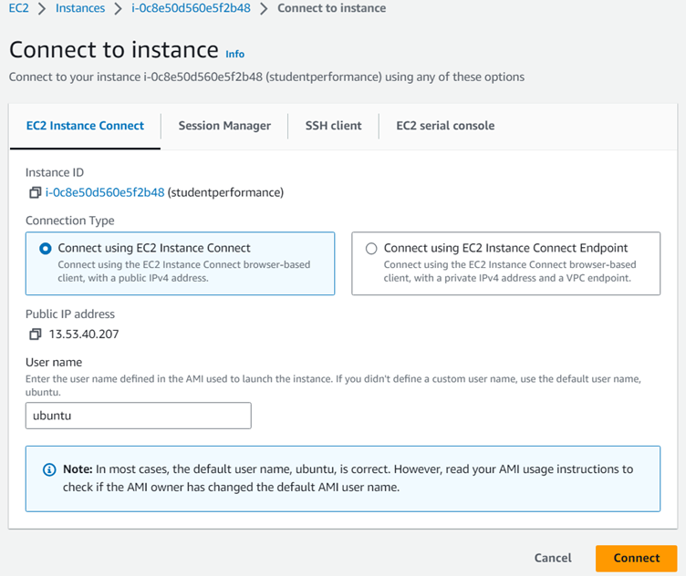

On launch of server instance, we need some setup commands.

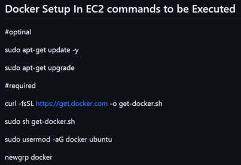

Next, setup a Runner from Github Actions. What a Runner does is, whenever we commit our code it gets triggered and handles all the CI/CD pipeline. It will perform all the checks, connect to our AWS, deploy Docker Image, all through our main.yaml file.

When setting up a Runner, we get commands which we need to run on our EC2 instance to link our Github repo with the EC2 instance.

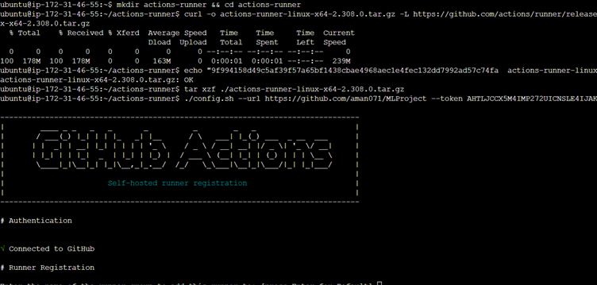

When set up and run, the server starts listening for jobs, which will come from our CI/CD pipeline.

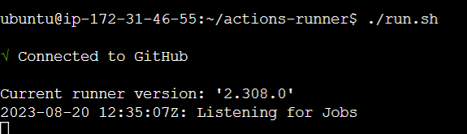

This also sets up the Runner in our Github

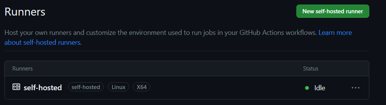

Some secret keys are added so that Github can connect and contact AWS.

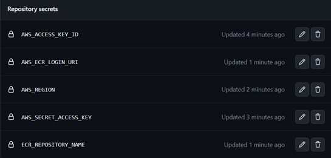

Now, whenever some commit is done, Runner automatically handles the deployment process for us.

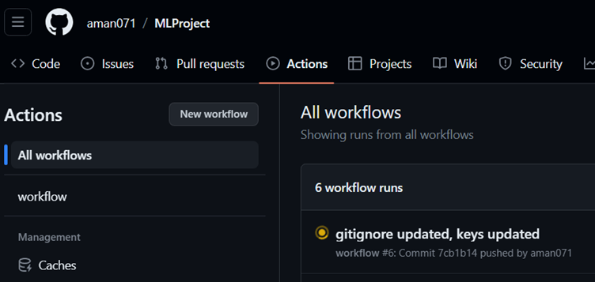

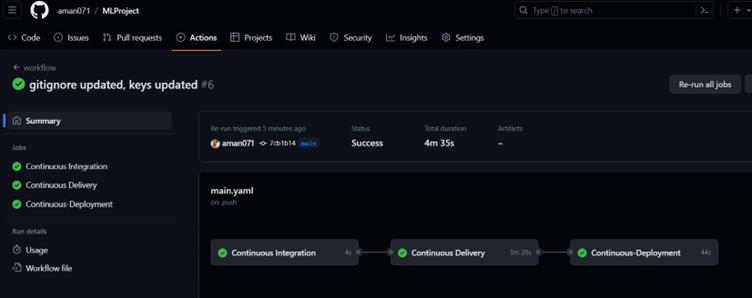

Now, we can go to our EC2 Instances in AWS Console

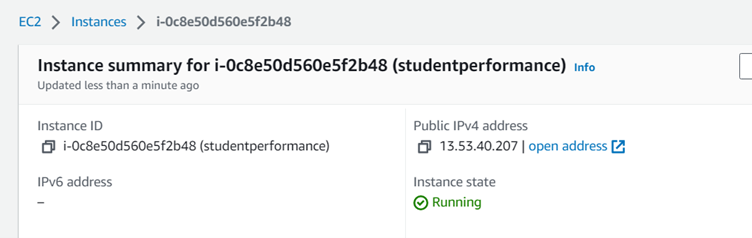

We can see a public IP. We need to copy and paste this into our address bar, and suffix it with the port mentioned in app.py

Our server is functional.

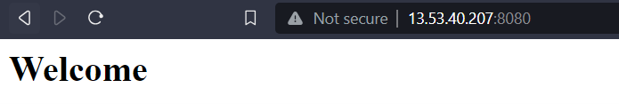

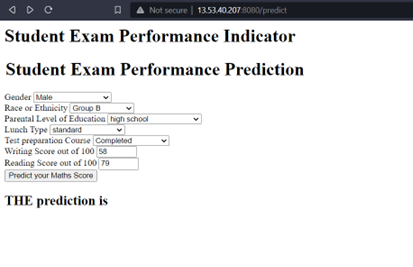

To avoid unnecessary charges,

Remove the Runner

Terminate the EC2 instance

Delete ECR entry

Delete user from IAM
